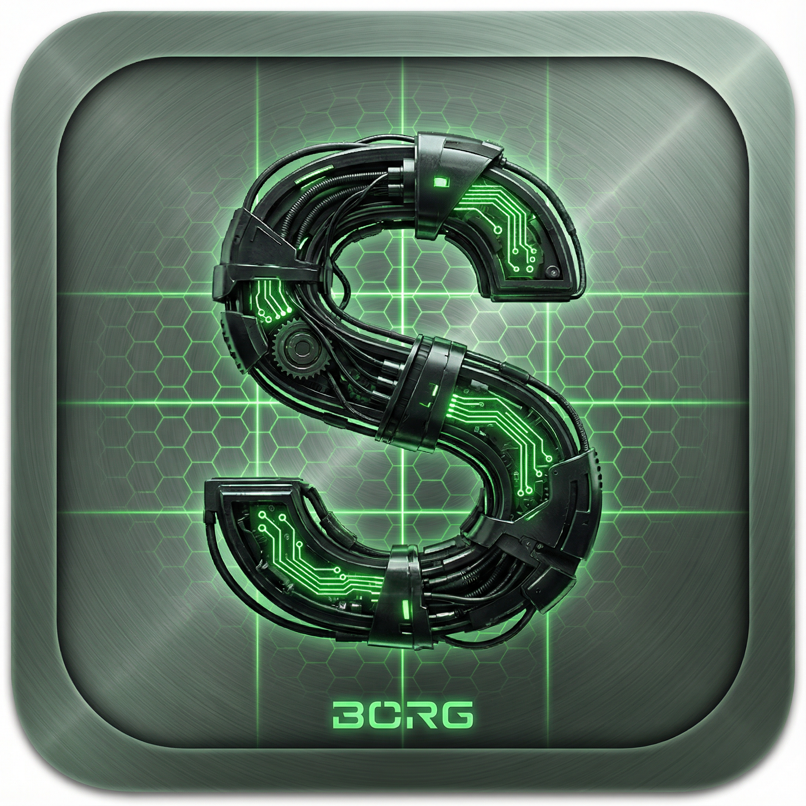

```
███████╗██╗   ██╗ ██████╗ ███╗   ██╗██╗   ██╗    ██████╗ ██████╗  ██████╗ ██╗    ██╗███████╗███████╗██████╗ 
██╔════╝██║   ██║██╔═══██╗████╗  ██║╚██╗ ██╔╝    ██╔══██╗██╔══██╗██╔═══██╗██║    ██║██╔════╝██╔════╝██╔══██╗
███████╗██║   ██║██║   ██║██╔██╗ ██║ ╚████╔╝     ██████╔╝██████╔╝██║   ██║██║ █╗ ██║███████╗█████╗  ██████╔╝
╚════██║╚██╗ ██╔╝██║   ██║██║╚██╗██║  ╚██╔╝      ██╔══██╗██╔══██╗██║   ██║██║███╗██║╚════██║██╔══╝  ██╔══██╗
███████║ ╚████╔╝ ╚██████╔╝██║ ╚████║   ██║       ██████╔╝██║  ██║╚██████╔╝╚███╔███╔╝███████║███████╗██║  ██║
╚══════╝  ╚═══╝   ╚═════╝ ╚═╝  ╚═══╝   ╚═╝       ╚═════╝ ╚═╝  ╚═╝ ╚═════╝  ╚══╝╚══╝ ╚══════╝╚══════╝╚═╝  ╚═╝
```

<p align="center">
  
</p>

<h1 align="center">🤖 POWERED BY BORG 🤖</h1>

<p align="center">
  <strong>Enterprise-Grade Evony Analysis Suite with Flash Browser, Dual Panels, Traffic Viewer, Protocol Explorer, Combat Simulator, AI Co-Pilot, and Self-Healing Error System</strong>
</p>

<p align="center">
  <a href="https://github.com/Ghenghis/SvonyBrowser/releases/latest"></a>
  <a href="https://github.com/Ghenghis/SvonyBrowser/releases"></a>
  <a href="https://github.com/Ghenghis/SvonyBrowser/blob/main/LICENSE"></a>
  
  
</p>

---

```
███████╗██╗   ██╗ ██████╗ ███╗   ██╗██╗   ██╗
██╔════╝██║   ██║██╔═══██╗████╗  ██║╚██╗ ██╔╝
█████╗  ██║   ██║██║   ██║██╔██╗ ██║ ╚████╔╝ 
██╔══╝  ╚██╗ ██╔╝██║   ██║██║╚██╗██║  ╚██╔╝  
███████╗ ╚████╔╝ ╚██████╔╝██║ ╚████║   ██║   
╚══════╝  ╚═══╝   ╚═════╝ ╚═╝  ╚═══╝   ╚═╝   
                                              
██████╗ ██████╗  ██████╗ ██╗    ██╗███████╗███████╗██████╗ 
██╔══██╗██╔══██╗██╔═══██╗██║    ██║██╔════╝██╔════╝██╔══██╗
██████╔╝██████╔╝██║   ██║██║ █╗ ██║███████╗█████╗  ██████╔╝
██╔══██╗██╔══██╗██║   ██║██║███╗██║╚════██║██╔══╝  ██╔══██╗
██████╔╝██║  ██║╚██████╔╝╚███╔███╔╝███████║███████╗██║  ██║
╚═════╝ ╚═╝  ╚═╝ ╚═════╝  ╚══╝╚══╝ ╚══════╝╚══════╝╚═╝  ╚═╝
```

---

## 🎯 TABLE OF CONTENTS

| Section | Description |
|---------|-------------|
| [Overview](#-overview) | What is Svony Browser |
| [Features](#-features) | Complete feature list |
| [Architecture](#-architecture) | System design |
| [Installation](#-installation) | How to install |
| [Configuration](#-configuration) | Setup options |
| [Services](#-services) | All 30+ services |
| [API Reference](#-api-reference) | IPC handlers |
| [Fagan Inspection](#-fagan-inspection) | Code audit docs |
| [Troubleshooting](#-troubleshooting) | Common issues |
| [Credits](#-credits) | Acknowledgments |

---

## 🌟 OVERVIEW

```
╔══════════════════════════════════════════════════════════════════════════════╗
║                                                                              ║
║   ███████╗██╗   ██╗ ██████╗ ███╗   ██╗██╗   ██╗                              ║
║   ██╔════╝██║   ██║██╔═══██╗████╗  ██║╚██╗ ██╔╝                              ║
║   ███████╗██║   ██║██║   ██║██╔██╗ ██║ ╚████╔╝                               ║
║   ╚════██║╚██╗ ██╔╝██║   ██║██║╚██╗██║  ╚██╔╝                                ║
║   ███████║ ╚████╔╝ ╚██████╔╝██║ ╚████║   ██║                                 ║
║   ╚══════╝  ╚═══╝   ╚═════╝ ╚═╝  ╚═══╝   ╚═╝                                 ║
║                                                                              ║
║   The Ultimate Evony Game Analysis Suite                                     ║
║   Built for Power Users, Botters, and Analysts                               ║
║                                                                              ║
╚══════════════════════════════════════════════════════════════════════════════╝
```

**Svony Browser** is an enterprise-grade Evony game analysis suite built on Electron 9.4.4 with Pepper Flash support. It provides:

- **Dual-Panel Browser** - Run AutoEvony bot and Evony client side-by-side
- **Traffic Analysis** - Real-time AMF3 protocol decoding and inspection
- **Combat Simulation** - Calculate battle outcomes before attacking
- **AI Co-Pilot** - LLM-powered assistant for gameplay optimization
- **Self-Healing** - Automatic error detection and recovery
- **Hybrid Mode** - Playwright-powered automation for advanced scripting

---

## 🚀 FEATURES

### 🖥️ DUAL-PANEL BROWSER SYSTEM

```
┌─────────────────────────────────────────────────────────────────────────────┐
│  ╔═══════════════════════════╗   ╔═══════════════════════════╗              │
│  ║     LEFT PANEL            ║   ║     RIGHT PANEL           ║              │
│  ║  ┌─────────────────────┐  ║   ║  ┌─────────────────────┐  ║              │
│  ║  │                     │  ║   ║  │                     │  ║              │
│  ║  │    AUTOEVONY        │  ║   ║  │    EVONY CLIENT     │  ║              │
│  ║  │    SWF BOT          │  ║   ║  │    FLASH GAME       │  ║              │
│  ║  │                     │  ║   ║  │                     │  ║              │
│  ║  │  ┌───┐ ┌───┐ ┌───┐  │  ║   ║  │  ┌───┐ ┌───┐ ┌───┐  │  ║              │
│  ║  │  │WEB│ │SWF│ │HYB│  │  ║   ║  │  │WEB│ │SWF│ │HYB│  │  ║              │
│  ║  │  └───┘ └───┘ └───┘  │  ║   ║  │  └───┘ └───┘ └───┘  │  ║              │
│  ║  └─────────────────────┘  ║   ║  └─────────────────────┘  ║              │
│  ╚═══════════════════════════╝   ╚═══════════════════════════╝              │
│                          ◄─── SPLITTER ───►                                 │
│                              (Draggable)                                    │
└─────────────────────────────────────────────────────────────────────────────┘
```

| Feature | Description |
|---------|-------------|
| **Side-by-Side Panels** | Run AutoEvony and Evony client simultaneously |
| **Mode Toggle** | Switch between Web, SWF, and Hybrid modes per panel |
| **Panel Swap** | Instantly swap left and right panel contents |
| **Resizable Splitter** | Drag to resize panels, touch support included |
| **Auto-Size Presets** | 50/50, 70/30, 30/70 quick presets |
| **Session Sync** | Share cookies and sessions between panels |
| **Server Selector** | Quick switch between cc1-cc5 servers |

### 🔍 TRAFFIC VIEWER & PROTOCOL EXPLORER

```
┌─────────────────────────────────────────────────────────────────────────────┐
│  TRAFFIC VIEWER - Real-time AMF3 Protocol Analysis                          │
├─────────────────────────────────────────────────────────────────────────────┤
│                                                                             │
│  ┌─────────┬─────────┬──────────────────────────────────────────────────┐   │
│  │ TIME    │ TYPE    │ DECODED PAYLOAD                                  │   │
│  ├─────────┼─────────┼──────────────────────────────────────────────────┤   │
│  │ 15:28:04│ REQUEST │ server.login { user: "Borg", pass: "***" }       │   │
│  │ 15:28:05│ RESPONSE│ login.success { sid: "abc123", cities: [...] }   │   │
│  │ 15:28:10│ REQUEST │ city.getInfo { cityId: 3796 }                    │   │
│  │ 15:28:11│ RESPONSE│ city.info { name: "aattack", pop: 44841205 }     │   │
│  │ 15:28:15│ REQUEST │ army.march { target: [0,0], troops: {...} }      │   │
│  └─────────┴─────────┴──────────────────────────────────────────────────┘   │
│                                                                             │
│  [▶ Start] [⏸ Pause] [🗑 Clear] [💾 Export] [🔍 Filter]                      │
│                                                                             │
└─────────────────────────────────────────────────────────────────────────────┘
```

| Feature | Description |
|---------|-------------|
| **AMF3 Decoding** | Full Action Message Format 3 protocol support |
| **Real-time Capture** | Live traffic monitoring with minimal overhead |
| **Request/Response Pairing** | Match requests to their responses |
| **Payload Inspection** | Deep dive into decoded message contents |
| **Export Options** | Save captures as JSON, CSV, or HAR format |
| **Filtering** | Filter by message type, content, or time range |
| **Proxy Support** | Route through Fiddler or custom proxy |

### ⚔️ COMBAT SIMULATOR

```
┌─────────────────────────────────────────────────────────────────────────────┐
│  COMBAT SIMULATOR - Battle Outcome Prediction                               │
├─────────────────────────────────────────────────────────────────────────────┤
│                                                                             │
│  ATTACKER: Borg (aattack)              DEFENDER: Target City                │
│  ┌────────────────────────┐            ┌────────────────────────┐           │
│  │ Workers:    113m       │            │ Workers:    50m        │           │
│  │ Warriors:   103m       │            │ Warriors:   25m        │           │
│  │ Scouts:     2.01b      │            │ Scouts:     500m       │           │
│  │ Pikemen:    2.05b      │            │ Pikemen:    1b         │           │
│  │ Swordsmen:  2.04b      │            │ Swordsmen:  800m       │           │
│  │ Archers:    2.06b      │            │ Archers:    1.5b       │           │
│  │ Cavalry:    2.05b      │            │ Cavalry:    900m       │           │
│  │ Cataphracts:1.76b      │            │ Cataphracts:600m       │           │
│  │ Transporters:1.29b     │            │ Transporters:400m      │           │
│  │ Ballista:   1.54b      │            │ Ballista:   300m       │           │
│  │ Battering:  1.89b      │            │ Battering:  500m       │           │
│  │ Catapults:  1.97b      │            │ Catapults:  400m       │           │
│  └────────────────────────┘            └────────────────────────┘           │
│                                                                             │
│  ═══════════════════════════════════════════════════════════════════════    │
│  SIMULATION RESULT: ✅ VICTORY                                              │
│  Estimated Losses: 15% | Enemy Losses: 100% | Resources Gained: 2.5B        │
│  ═══════════════════════════════════════════════════════════════════════    │
│                                                                             │
│  [🎯 Simulate] [📊 Detailed Report] [💾 Save Preset] [📋 Load Preset]        │
│                                                                             │
└─────────────────────────────────────────────────────────────────────────────┘
```

| Feature | Description |
|---------|-------------|
| **Troop Calculator** | Input attacker and defender troop counts |
| **Hero Bonuses** | Factor in hero attack/defense bonuses |
| **Tech Research** | Include military research bonuses |
| **Wall Defenses** | Account for fortifications and traps |
| **Outcome Prediction** | Win/Loss probability with confidence |
| **Loss Estimation** | Predicted troop losses for both sides |
| **Resource Calculation** | Expected plunder from victory |

### 🤖 AI CO-PILOT (LLM Integration)

```
┌─────────────────────────────────────────────────────────────────────────────┐
│  AI CO-PILOT - Your Intelligent Gaming Assistant                            │
├─────────────────────────────────────────────────────────────────────────────┤
│                                                                             │
│  ┌─────────────────────────────────────────────────────────────────────┐    │
│  │ 🤖 AI: Hello Borg! I see you have 3/3 free hero rolls today.        │    │
│  │     Would you like me to help optimize your hero recruitment?       │    │
│  ├─────────────────────────────────────────────────────────────────────┤    │
│  │ 👤 You: Yes, what stats should I look for?                          │    │
│  ├─────────────────────────────────────────────────────────────────────┤    │
│  │ 🤖 AI: For your current strategy, I recommend:                      │    │
│  │     • Politics: 100+ (for resource production)                      │    │
│  │     • Attack: 80+ (for offensive operations)                        │    │
│  │     • Intelligence: 70+ (for research speed)                        │    │
│  │                                                                     │    │
│  │     Your current hero "Borg" has Politics:107, Attack:59, Int:55    │    │
│  │     Consider rolling for better Attack stats.                       │    │
│  └─────────────────────────────────────────────────────────────────────┘    │
│                                                                             │
│  [Type your message...                                          ] [Send]    │
│                                                                             │
│  Providers: [LM Studio] [Ollama] [OpenAI] [Claude]                          │
│                                                                             │
└─────────────────────────────────────────────────────────────────────────────┘
```

| Feature | Description |
|---------|-------------|
| **Multiple LLM Providers** | LM Studio, Ollama, OpenAI, Claude, Gemini |
| **Context Awareness** | Understands current game state |
| **Strategy Suggestions** | Recommends optimal gameplay decisions |
| **Traffic Analysis** | Explains decoded protocol messages |
| **Combat Advice** | Helps plan attacks and defenses |
| **Conversation Memory** | Remembers previous interactions |
| **Voice Input/Output** | Speak commands, hear responses |

### 🔧 HYBRID MODE (Playwright Automation)

```
┌─────────────────────────────────────────────────────────────────────────────┐
│  HYBRID MODE - Playwright-Powered Automation                                │
├─────────────────────────────────────────────────────────────────────────────┤
│                                                                             │
│  ┌─────────────────────────────────────────────────────────────────────┐    │
│  │  STATUS: 🟢 ACTIVE                                                  │    │
│  │  Browser: Chromium 119.0.6045.9                                     │    │
│  │  Page: https://cc2.evony.com/                                       │    │
│  │  Session: Authenticated as "Borg"                                   │    │
│  └─────────────────────────────────────────────────────────────────────┘    │
│                                                                             │
│  AVAILABLE ACTIONS:                                                         │
│  ┌─────────────┐ ┌─────────────┐ ┌─────────────┐ ┌─────────────┐           │
│  │ Auto-Login  │ │ Form Fill   │ │ Screenshot  │ │ Intercept   │           │
│  └─────────────┘ └─────────────┘ └─────────────┘ └─────────────┘           │
│  ┌─────────────┐ ┌─────────────┐ ┌─────────────┐ ┌─────────────┐           │
│  │ Click       │ │ Type        │ │ Wait        │ │ Navigate    │           │
│  └─────────────┘ └─────────────┘ └─────────────┘ └─────────────┘           │
│                                                                             │
│  SCRIPT EDITOR:                                                             │
│  ┌─────────────────────────────────────────────────────────────────────┐    │
│  │ await page.click('#login-button');                                  │    │
│  │ await page.fill('#username', 'Borg');                               │    │
│  │ await page.fill('#password', '***');                                │    │
│  │ await page.click('#submit');                                        │    │
│  └─────────────────────────────────────────────────────────────────────┘    │
│                                                                             │
│  [▶ Run Script] [💾 Save] [📂 Load] [🔄 Reset]                               │
│                                                                             │
└─────────────────────────────────────────────────────────────────────────────┘
```

| Feature | Description |
|---------|-------------|
| **Playwright Integration** | Full Playwright browser automation |
| **Auto-Login** | Intelligent login form detection and filling |
| **Request Interception** | Monitor and modify network requests |
| **Screenshot Capture** | Take screenshots for debugging |
| **Script Runner** | Execute custom automation scripts |
| **Session Persistence** | Maintain login state across restarts |
| **Multi-Tab Support** | Manage multiple browser contexts |

### 🛡️ SELF-HEALING ERROR SYSTEM

```
┌─────────────────────────────────────────────────────────────────────────────┐
│  SELF-HEALING ERROR SYSTEM                                                  │
├─────────────────────────────────────────────────────────────────────────────┤
│                                                                             │
│  ┌─────────────────────────────────────────────────────────────────────┐    │
│  │ ⚠️  ERROR DETECTED                                                  │    │
│  │ File: services/panel-manager.js                                     │    │
│  │ Line: 245                                                           │    │
│  │ Error: Cannot read property 'webContents' of undefined              │    │
│  ├─────────────────────────────────────────────────────────────────────┤    │
│  │ 🔍 ANALYSIS                                                         │    │
│  │ Root Cause: Panel was destroyed before webContents access           │    │
│  │ Frequency: 3 occurrences in last 5 minutes                          │    │
│  │ Impact: Medium - Panel functionality affected                       │    │
│  ├─────────────────────────────────────────────────────────────────────┤    │
│  │ 🔧 AUTO-HEALING APPLIED                                             │    │
│  │ Action: Added null check before webContents access                  │    │
│  │ Status: ✅ RESOLVED                                                 │    │
│  └─────────────────────────────────────────────────────────────────────┘    │
│                                                                             │
│  ERROR STATISTICS:                                                          │
│  Total Errors: 47 | Auto-Healed: 42 | Manual Fix Required: 5               │
│                                                                             │
└─────────────────────────────────────────────────────────────────────────────┘
```

| Feature | Description |
|---------|-------------|
| **Error Tracking** | Capture all errors with file/line numbers |
| **Pattern Recognition** | Identify recurring error patterns |
| **Auto-Healing** | Automatically apply fixes for known issues |
| **Solution Database** | Knowledge base of error solutions |
| **Error Helper** | Suggests fixes for unknown errors |
| **Statistics Dashboard** | Track error frequency and resolution |

---

## 🏗️ ARCHITECTURE

```
┌─────────────────────────────────────────────────────────────────────────────┐
│                           SVONY BROWSER ARCHITECTURE                        │
├─────────────────────────────────────────────────────────────────────────────┤
│                                                                             │
│  ┌─────────────────────────────────────────────────────────────────────┐    │
│  │                         MAIN PROCESS (index.js)                     │    │
│  │  ┌──────────┐ ┌──────────┐ ┌──────────┐ ┌──────────┐ ┌──────────┐   │    │
│  │  │  Flash   │ │  Panel   │ │ Network  │ │   MCP    │ │  Error   │   │    │
│  │  │ Detector │ │ Manager  │ │ Inspector│ │  Client  │ │ Tracker  │   │    │
│  │  └──────────┘ └──────────┘ └──────────┘ └──────────┘ └──────────┘   │    │
│  │  ┌──────────┐ ┌──────────┐ ┌──────────┐ ┌──────────┐ ┌──────────┐   │    │
│  │  │ Chatbot  │ │Playwright│ │  Combat  │ │  Game    │ │  Self    │   │    │
│  │  │ Service  │ │ Service  │ │Simulator │ │  State   │ │ Healer   │   │    │
│  │  └──────────┘ └──────────┘ └──────────┘ └──────────┘ └──────────┘   │    │
│  └─────────────────────────────────────────────────────────────────────┘    │
│                                    │                                        │
│                                    │ IPC                                    │
│                                    ▼                                        │
│  ┌─────────────────────────────────────────────────────────────────────┐    │
│  │                      RENDERER PROCESS (renderer.js)                 │    │
│  │  ┌──────────────────────────────────────────────────────────────┐   │    │
│  │  │                      browser.html                            │   │    │
│  │  │  ┌─────────────┐  ┌─────────────┐  ┌─────────────────────┐   │   │    │
│  │  │  │ Left Panel  │  │ Right Panel │  │ Bottom Tools Panel  │   │   │    │
│  │  │  │  (WebView)  │  │  (WebView)  │  │ Traffic│Chat│Combat │   │   │    │
│  │  │  └─────────────┘  └─────────────┘  └─────────────────────┘   │   │    │
│  │  └──────────────────────────────────────────────────────────────┘   │    │
│  └─────────────────────────────────────────────────────────────────────┘    │
│                                                                             │
│  ┌─────────────────────────────────────────────────────────────────────┐    │
│  │                         EXTERNAL RESOURCES                          │    │
│  │  ┌──────────┐ ┌──────────┐ ┌──────────┐ ┌──────────┐ ┌──────────┐   │    │
│  │  │ Flash    │ │AutoEvony │ │  Evony   │ │ LM Studio│ │   MCP    │   │    │
│  │  │ Plugin   │ │   SWF    │ │  Client  │ │  Server  │ │ Servers  │   │    │
│  │  └──────────┘ └──────────┘ └──────────┘ └──────────┘ └──────────┘   │    │
│  └─────────────────────────────────────────────────────────────────────┘    │
│                                                                             │
└─────────────────────────────────────────────────────────────────────────────┘
```

### File Structure

```
SvonyBrowser/
├── index.js                 # Main process entry point (1,200+ lines)
├── renderer.js              # Renderer process logic (800+ lines)
├── browser.html             # Main UI template
├── preload.js               # Preload script for security
├── store.js                 # Electron store configuration
├── package.json             # Dependencies and build config
│
├── services/                # 30+ service modules
│   ├── panel-manager.js     # Panel lifecycle management
│   ├── network-inspector.js # Traffic capture and analysis
│   ├── traffic-processor.js # AMF3 decoding
│   ├── amf3-decoder.js      # Action Message Format decoder
│   ├── chatbot-service.js   # AI co-pilot integration
│   ├── lm-studio-client.js  # LM Studio API client
│   ├── playwright-service.js# Playwright automation
│   ├── combat-simulator.js  # Battle calculations
│   ├── game-state-tracker.js# Game state management
│   ├── error-tracker.js     # Error logging with line numbers
│   ├── error-helper.js      # Solution suggestions
│   ├── self-healer.js       # Auto-fix system
│   ├── mcp-client-manager.js# MCP protocol client
│   ├── protocol-handler.js  # Custom protocol handling
│   └── ... (20+ more)
│
├── flashver/                # Flash player assets
│   ├── pepflashplayer32.dll # Windows 32-bit Flash
│   ├── pepflashplayer64.dll # Windows 64-bit Flash
│   ├── libpepflashplayer.so # Linux Flash
│   ├── PepperFlashPlayer.plugin # macOS Flash
│   └── swiftshader/         # GPU emulation
│       ├── libEGL.dll
│       └── libGLESv2.dll
│
├── swf/                     # SWF files
│   └── AutoEvony.swf        # AutoEvony bot (4.5MB)
│
├── icons/                   # Application icons
│   ├── autoevony/           # AutoEvony theme icons
│   ├── borg/                # Borg theme icons
│   └── installer/           # Installer banners
│
├── themes/                  # CSS themes
│   ├── svony-theme.css      # Main theme
│   └── hybrid-error-styles.css
│
├── docs/                    # Documentation
│   └── fagan-inspection/    # 38 Fagan audit documents
│
└── .github/workflows/       # CI/CD
    └── build.yml            # Build and release workflow
```

---

## 📦 INSTALLATION

### Windows (Recommended)

```
┌─────────────────────────────────────────────────────────────────────────────┐
│  DOWNLOAD OPTIONS                                                           │
├─────────────────────────────────────────────────────────────────────────────┤
│                                                                             │
│  64-bit Windows (Windows 10/11):                                            │
│  ┌─────────────────────────────────────────────────────────────────────┐    │
│  │ 📦 SvonyBrowser-Portable-x64.exe  (Recommended - No install needed) │    │
│  │ 📦 SvonyBrowser-Setup-x64.exe     (Installer version)               │    │
│  └─────────────────────────────────────────────────────────────────────┘    │
│                                                                             │
│  32-bit Windows (Windows 7/10):                                             │
│  ┌─────────────────────────────────────────────────────────────────────┐    │
│  │ 📦 SvonyBrowser-Portable-ia32.exe (Recommended - No install needed) │    │
│  │ 📦 SvonyBrowser-Setup-ia32.exe    (Installer version)               │    │
│  └─────────────────────────────────────────────────────────────────────┘    │
│                                                                             │
└─────────────────────────────────────────────────────────────────────────────┘
```

**Download from:** [GitHub Releases](https://github.com/Ghenghis/SvonyBrowser/releases/latest)

### From Source

```bash
# Clone the repository
git clone https://github.com/Ghenghis/SvonyBrowser.git
cd SvonyBrowser

# Install dependencies
npm install

# Run in development mode
npm start

# Build for production
npm run build
```

---

## ⚙️ CONFIGURATION

### Flash Player Setup

The Flash player DLLs are included in the `flashver/` directory:

| File | Platform | Size |
|------|----------|------|
| pepflashplayer64.dll | Windows 64-bit | 31 MB |
| pepflashplayer32.dll | Windows 32-bit | 18 MB |
| libpepflashplayer.so | Linux 64-bit | 20 MB |
| PepperFlashPlayer.plugin | macOS | 27 MB |

### LLM Configuration

Configure AI providers in the chatbot settings:

```json
{
  "lmStudio": {
    "host": "localhost",
    "port": 1234,
    "model": "default"
  },
  "ollama": {
    "host": "localhost",
    "port": 11434,
    "model": "llama2"
  },
  "openai": {
    "apiKey": "sk-...",
    "model": "gpt-4"
  }
}
```

---

## 🔌 SERVICES

### Complete Service List (30+ Services)

| Service | File | Lines | Description |
|---------|------|-------|-------------|
| Panel Manager | panel-manager.js | 800+ | Panel lifecycle, webview management |
| Network Inspector | network-inspector.js | 600+ | Traffic capture, request logging |
| Traffic Processor | traffic-processor.js | 400+ | AMF3 decoding, message parsing |
| AMF3 Decoder | amf3-decoder.js | 500+ | Action Message Format decoder |
| Chatbot Service | chatbot-service.js | 700+ | AI co-pilot, multi-provider |
| LM Studio Client | lm-studio-client.js | 300+ | LM Studio API integration |
| Playwright Service | playwright-service.js | 600+ | Browser automation |
| Combat Simulator | combat-simulator.js | 400+ | Battle calculations |
| Game State Tracker | game-state-tracker.js | 500+ | State management |
| Error Tracker | error-tracker.js | 400+ | Error logging |
| Error Helper | error-helper.js | 300+ | Solution suggestions |
| Self Healer | self-healer.js | 350+ | Auto-fix system |
| MCP Client Manager | mcp-client-manager.js | 500+ | MCP protocol |
| Protocol Handler | protocol-handler.js | 200+ | Custom protocols |
| Session Recorder | session-recorder.js | 300+ | Session capture |
| Proxy Monitor | proxy-monitor.js | 250+ | Proxy management |
| Agent Controller | agent-controller.js | 400+ | Agent orchestration |
| Intent Router | intent-router.js | 300+ | Intent classification |
| Voice Service | voice-service.js | 350+ | Speech I/O |
| Conversation Memory | conversation-memory.js | 250+ | Chat history |
| Debug Manager | debug-manager.js | 200+ | Debug tools |
| Performance Profiler | performance-profiler.js | 300+ | Performance monitoring |
| Fiddler Bridge | fiddler-bridge.js | 200+ | Fiddler integration |
| Script Runner | script-runner.js | 400+ | Script execution |
| Automation Templates | automation-templates.js | 300+ | Preset automations |
| Chatbot Plugins | chatbot-plugins.js | 250+ | Plugin system |
| Asset Verifier | asset-verifier.js | 300+ | Asset validation |

---

## 📚 API REFERENCE

### IPC Handlers (Main Process)

```javascript
// Panel Management
ipcMain.handle('panel-create', (event, config) => {...})
ipcMain.handle('panel-destroy', (event, panelId) => {...})
ipcMain.handle('panel-navigate', (event, panelId, url) => {...})
ipcMain.handle('panel-reload', (event, panelId) => {...})

// Flash Detection
ipcMain.handle('get-flash-status', () => {...})
ipcMain.handle('open-flashver-folder', () => {...})

// Traffic Analysis
ipcMain.handle('traffic-start-capture', () => {...})
ipcMain.handle('traffic-stop-capture', () => {...})
ipcMain.handle('traffic-get-messages', () => {...})

// AI Co-Pilot
ipcMain.handle('chatbot-send-message', (event, message) => {...})
ipcMain.handle('chatbot-set-provider', (event, provider) => {...})

// Hybrid Mode
ipcMain.handle('panel-hybrid-activate', (event, panelId, url) => {...})
ipcMain.handle('panel-hybrid-deactivate', (event, panelId) => {...})

// Error System
ipcMain.handle('error-track', (event, error) => {...})
ipcMain.handle('error-get-stats', () => {...})
ipcMain.handle('self-heal-attempt', (event, errorId) => {...})
```

---

## 📋 FAGAN INSPECTION

Complete Fagan Inspection documentation available in `docs/fagan-inspection/`:

| Document | Content |
|----------|---------|
| 00-INDEX.md | Master index |
| 01-MAIN-PROCESS-AUDIT.md | index.js audit |
| 02-RENDERER-PROCESS-AUDIT.md | renderer.js audit |
| 03-SERVICES-CORE-AUDIT.md | Core services |
| 04-SERVICES-NETWORK-AUDIT.md | Network services |
| 05-SERVICES-AI-AUDIT.md | AI services |
| 06-SERVICES-AUTOMATION-AUDIT.md | Automation |
| 07-SERVICES-ERROR-AUDIT.md | Error system |
| 08-BUILD-CONFIG-AUDIT.md | Build config |
| 09-MCP-INTEGRATION-AUDIT.md | MCP integration |
| 10-WIRING-ANALYSIS.md | Component wiring |
| ... | 38 total documents |
| 99-MASTER-ISSUES-SUMMARY.md | All issues |

---

## 🔧 TROUBLESHOOTING

### Flash Player Not Found

```
┌─────────────────────────────────────────────────────────────────────────────┐
│  SOLUTION: Flash Player Not Found                                           │
├─────────────────────────────────────────────────────────────────────────────┤
│                                                                             │
│  The app checks these locations for Flash DLLs:                             │
│                                                                             │
│  1. resources/flashver/pepflashplayer64.dll (packaged app)                  │
│  2. flashver/pepflashplayer64.dll (development)                             │
│  3. [app-path]/flashver/pepflashplayer64.dll                                │
│  4. [exe-dir]/flashver/pepflashplayer64.dll                                 │
│                                                                             │
│  If Flash is not detected:                                                  │
│  • Ensure flashver/ folder exists next to the executable                    │
│  • Verify DLL files are not corrupted (check file sizes)                    │
│  • Run as Administrator if permission issues                                │
│                                                                             │
└─────────────────────────────────────────────────────────────────────────────┘
```

### Common Issues

| Issue | Solution |
|-------|----------|
| App crashes on startup | Use v2.2.5 (stable fallback) |
| Flash not loading | Check flashver/ folder location |
| Panels not resizing | Update to v2.2.3+ |
| AI not responding | Check LM Studio is running |
| Traffic not capturing | Enable network inspector |

---

## 🙏 CREDITS

```
┌─────────────────────────────────────────────────────────────────────────────┐
│  CREDITS & ACKNOWLEDGMENTS                                                  │
├─────────────────────────────────────────────────────────────────────────────┤
│                                                                             │
│  Project: Svony Browser / Evony Browser                                     │
│  Author: Ghenghis                                                           │
│  Theme: Powered by Borg                                                     │
│                                                                             │
│  Built With:                                                                │
│  • Electron 9.4.4 (Flash support)                                           │
│  • Pepper Flash Player                                                      │
│  • Playwright (automation)                                                  │
│  • Node.js                                                                  │
│                                                                             │
│  Inspired By:                                                               │
│  • AutoEvony                                                                │
│  • RoboEvony                                                                │
│  • FlashBrowser                                                             │
│                                                                             │
│  Special Thanks:                                                            │
│  • The Evony community                                                      │
│  • Flash preservation efforts                                               │
│  • Open source contributors                                                 │
│                                                                             │
└─────────────────────────────────────────────────────────────────────────────┘
```

---

<p align="center">
  
  
  
</p>

<h3 align="center">🤖 RESISTANCE IS FUTILE - YOU WILL BE ASSIMILATED 🤖</h3>

<p align="center">
  <strong>Svony Browser &amp; Evony Browser - Powered by Borg</strong>
</p>

---

```
██████╗  ██████╗ ██████╗  ██████╗ 
██╔══██╗██╔═══██╗██╔══██╗██╔════╝ 
██████╔╝██║   ██║██████╔╝██║  ███╗
██╔══██╗██║   ██║██╔══██╗██║   ██║
██████╔╝╚██████╔╝██║  ██║╚██████╔╝
╚═════╝  ╚═════╝ ╚═╝  ╚═╝ ╚═════╝ 
```

<p align="center">Made with ❤️ for the Evony Community</p>
